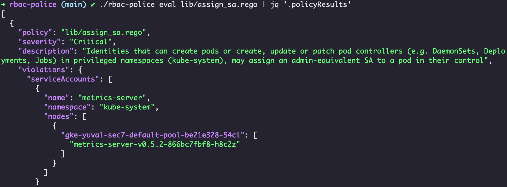

# rbac-police 
Retrieve the RBAC permissions of Kubernetes identities - service accounts, pods, nodes, users and groups - and evaluate them using policies written in Rego.



The [policy library](./lib) includes over 20 policies that detect identities possessing risky permissions, each alerting on a different attack path. 

## Quick Start

1. Clone the repository:

    ```shell
    git clone https://github.com/PaloAltoNetworks/rbac-police && cd rbac-police
    ```
2. Either install `rbac-police` from a release:

    ```shell
    OS=linux  # OS=darwin
    ARCH=amd64  # ARCH=arm64
    LATEST_TAG=$(curl -s https://api.github.com/repos/PaloAltoNetworks/rbac-police/releases/latest | jq -r '.tag_name')
    curl -L -o rbac-police "https://github.com/PaloAltoNetworks/rbac-police/releases/download/${LATEST_TAG}/rbac-police_${LATEST_TAG}_${OS}_${ARCH}" && chmod +x rbac-police
    ```
    Or build it with [Golang](https://go.dev/doc/install)>=1.16:
    
    ```shell
    go build
    ```
3. Connect `kubectl` to a Kubernetes cluster.
4. Evaluate RBAC permissions and identify privilege escalation paths in your cluster using the default policy library:

    ```
    ./rbac-police eval lib/
    ```
5. Inspect the permissions of violating principals and identify the Roles and ClusterRoles granting them risky privileges. See the Recommendations section [here](https://www.paloaltonetworks.com/resources/whitepapers/kubernetes-privilege-escalation-excessive-permissions-in-popular-platforms) for remediation advice. 
    ```
    ./rbac-police expand -z sa=production-ns:violating-sa
    ```

## Usage
### Set severity threshold
Only evaluate policies with a severity equal to or higher than a threshold.
```
./rbac-police eval lib/ -s High
```
### Inspect the permissions of specific identities
```
./rbac-police expand -z sa=kube-system:metrics-server
./rbac-police expand -z user=example@email.com
./rbac-police expand # all identities
```
### Discover protections
Improve accuracy by considering features gates and admission controllers that can protect against certain attacks. Note that [NodeRestriction](https://kubernetes.io/docs/reference/access-authn-authz/admission-controllers/#noderestriction) is identified by impersonating a node and *dry-run creating a pod*, which may be logged by some systems.
```
./rbac-police eval lib/ -w
```
### Configure violation types
Control which identities are evaluated for violations, default are `sa,node,combined` (see [policies.md](docs/policies.md) for more information).
```
./rbac-police eval lib/ --violations sa,user
./rbac-police eval lib/ --violations all # sa,node,combined,user,group
```
Note that by default, `rbac-police` only looks into service accounts assigned to a pod. Use `-a` to include all service accounts.
### Scope to a namespace
Only look into service accounts and pods from a certain namespace.
```
./rbac-police eval lib/ -n production
```
### Only SAs that exist on all nodes
Only alert on service accounts that exist on all nodes. Useful for identifying violating DaemonSets.
```
./rbac-police eval lib/ --only-sas-on-all-nodes
```
### Ignore control plane
Ignore control plane pods and nodes in clusters that host the control plane.
```
./rbac-police eval lib/ --ignore-controlplane
```
### Collect once for multiple evaluations
```
./rbac-police collect -o rbacDb.json

./rbac-police eval lib/ rbacDb.json -s High
./rbac-police eval lib/ rbacDb.json -s Medium --only-sas-on-all-nodes
./rbac-police expand rbacDb.json -z sa=ns:violating-sa
```

## Documentation
 - [Policies](docs/policies.md)
 - [Eval command](docs/eval.md)
 - [Collect command](docs/collect.md)
 - [Expand command](docs/expand.md)

## Media Mentions
Radiohead:
> rbac-police, I've given all I can. It's not enough...

N.W.A:
> rbac-police comin' straight from the underground!
